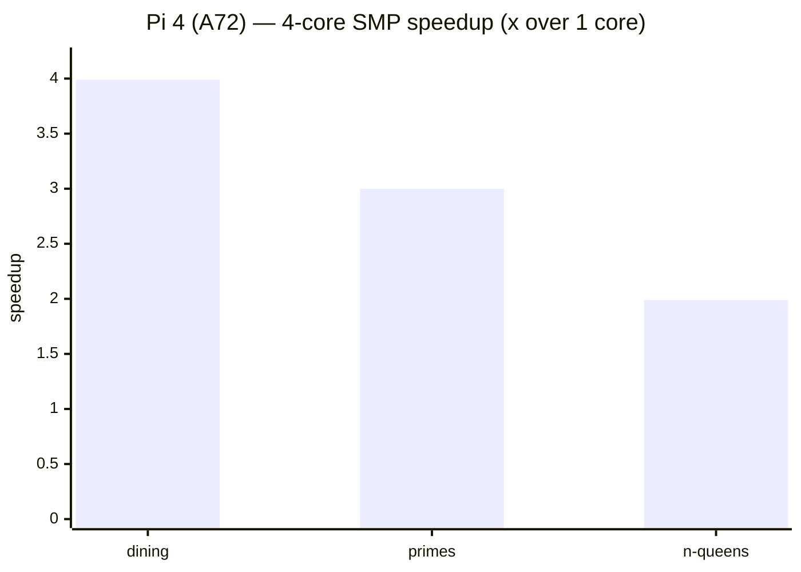
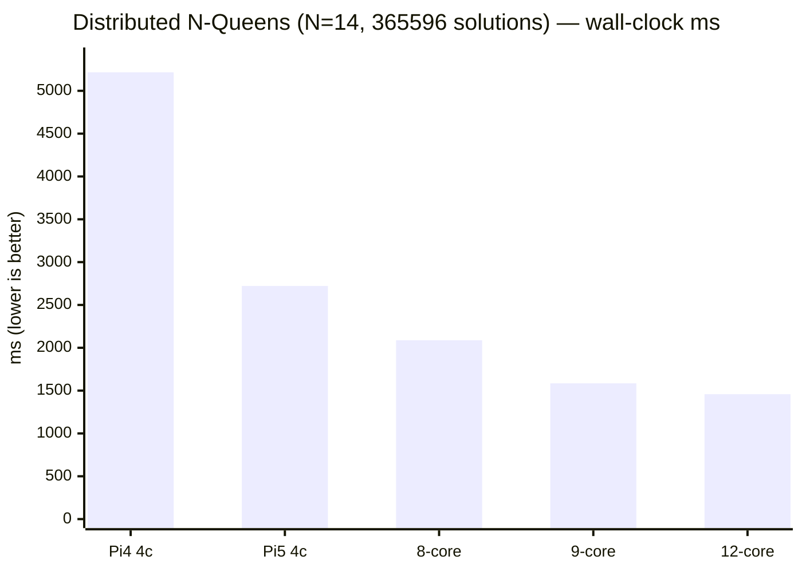

# xinu-rpi4

Embedded Xinu port for the **Raspberry Pi 4 (BCM2711, Cortex-A72, AArch64)**,
running on real hardware. The same source tree also cross-builds for the
QEMU `virt` machine.

Bootstrapped from [`yaskodama/xinu-rpi`](https://github.com/yaskodama/xinu-rpi)
(32-bit arm-qemu / arm-rpi) and the AArch64 boot pattern from
[`radlyeel/leex`](https://github.com/radlyeel/leex). It has since grown from a
serial hello-world into a small interactive system with an HDMI window manager,
USB-A input, virtual memory, networking (wired + WiFi mesh), an on-device C JIT,
an actor runtime, and an HTTP control plane.


*Real hardware (Pi 4 / BCM2711) over HDMI — the window manager with the runtime
monitor, UART shell, live-actor and system-status panels, and the on-screen
**BASIC** window running its `koch` sample to draw a Koch snowflake.*

## Multi-core SMP, D-cache & self-forming Wi-Fi mesh (2026 experiments)

This port is one of three siblings — **xinu-rpi3 (A53)**, **xinu-rpi4 (A72,
this one)**, **xinu-rpi5 (A76)** — joined into a single self-forming cluster and
benchmarked together. Full write-ups are in the companion `smp_report`
(per-board SMP + D-cache) and `mesh_report` (mesh + distributed) PDFs.

**4-core worker-pool SMP.** Core 0 runs the OS; cores 1–3 are compute workers
(`system/smp.c`) that wait in `wfe` for a job posted to a lock-free mailbox, run
a `[lo,hi)` range function, and signal done. `boot.S` releases the secondaries
(smp_release[] + the Pi 4 armstub spin-table) into `_smp_start`, and
`mmu_enable_secondary()` brings each worker up on core 0's page tables with
**MMU + I-cache on, D-cache off**. Measured (`agree=yes`):

| Benchmark            | 1-core | 4-core | Speedup |
|----------------------|-------:|-------:|:-------:|
| dining (philosophers)| 273097 µs | 68278 µs | **3.99×** |
| primes (count)       | 158330 µs | 52633 µs | **3.00×** |
| n-queens (n=12, block split)     | 307814 µs | 154188 µs | 1.99× |
| n-queens (n=12, interleave `il=2`)| 308026 µs | 157383 µs | 1.95× |



**D-cache experiment.** The default build runs every core with the D-cache
**off**, so the mailbox is coherent for free. A `DCACHE_ON` build turns the
D-cache on and keeps the mailbox coherent with **explicit maintenance**
(`dc cvac` / `dc ivac`) instead. On this A72, writing `CPUECTLR_EL1.SMPEN` from
EL1 traps under the stock firmware, so the workers run `C=1` *without* hardware
cross-core coherency — the benchmark's `agree=` column then shows whether the
explicit clean/invalidate discipline is sufficient (it is). This established
that multi-core D-cache is workable on all three microarchitectures via explicit
cache maintenance.

**Self-forming Wi-Fi ad-hoc mesh.** All three boards join one IBSS cell with no
access point: SSID `MANET`, channel 6, fixed BSSID `02:4d:41:4e:45:54`, static
`10.0.0.n/24` (this board is **node 2 = 10.0.0.2**). A periodic **HELLO beacon**
(UDP/5000, every 2 s, `device/wifi/wifi.c`) announces the node id; each board
records the senders it hears, so neighbour tables fill automatically — power-on
and join is all it takes. Inspect convergence with `GET /manet`
(`node`, `rx`, `hello_tx`, `peers ids=`).

**Distributed benchmark routes.**
- `GET /bench?kind=nqueens|dining|primes[&n=N][&il=1|2][&cores=K]` — the SMP
  benchmark above (1-core vs 4-core, µs, speedup, `agree=`).
- `GET /nqpart?n=N&c0=A&c1=B` — count N-Queens solutions for first-queen columns
  `[c0,c1)`, split across this board's 4 cores. A Mac orchestrator hands each
  board a disjoint range and sums the partials, so the mesh solves one problem as
  a **12-core (3×4) distributed computer**: N=14 (365 596 solutions) in
  **1 458 ms — 1.87× the fastest single board**, sum verified.



## What works

**Boot & core kernel**
- AArch64 leex-style stub → BSS clear → `kernel_main` → window manager + shell.
- **MMU**: identity map + a **demand-paged virtual-memory window** (page-fault
  driven, VA `0x80000000`..`0x80400000`, 512-frame pool). D-cache off for DMA
  coherency; I-cache + MMU on.
- **Scheduler**: cooperative AArch64 `ctxsw` **and** preemptive fixed-priority
  off the GIC-400 + generic timer, with round-robin among equal priorities.
  Ready processes sit in per-priority FIFOs indexed by a 64-bit bitmap (O(1)
  dispatch); sleepers are on a deadline-sorted list, so the timer ISR reads a
  head instead of scanning `proctab`. Stack canaries catch overflow
  (`stkbad=` in `GET /ticks`). Measured on a 10 ms RT period under a CPU hog:
  **10 µs max jitter, 0 deadlines missed** (cooperative: 5162 µs, 46 % missed).
- First-fit kernel heap (`getmem`/`freemem`), 16-byte granular/aligned,
  coalescing, IRQ-safe. Covered by host unit tests (see *Testing*).

**Devices (BCM2711, on real hardware)**
- **HDMI framebuffer + window manager** — a 1280×960 virtual desktop with a
  movable/resizable shell window, smooth mouse cursor, and live monitors.
- **USB-A input** — BCM2711 PCIe RC bring-up + VL805 xHCI + hub enumeration
  (route string + TT) → **working USB mouse + keyboard** (on the USB-2.0 black
  ports; see *Known limits*).
- **Ethernet (GENET)** — static `192.168.3.100`, ARP + ICMP (pingable),
  16-slot RX ring.
- **WiFi (BCM43455)** — scan / WPA2 join / DHCP / ping / NTP / DNS / HTTP /
  TFTP / netboot, plus **MANET ad-hoc (IBSS) + on-demand AODV multi-hop mesh**
  (the same stack the Pi 4 + Pi 3 nodes use in the drone-HIL demo).

**Runtime & tooling**
- **On-device C JIT** (`cc`) — compiles a C subset to native AArch64 and runs it.
- **AIPL actor runtime** — resident actors, message send, a select/receive demo,
  and an actor-pool GC.
- **Embedded tiny LLM** (`llm`) — a baked-in transformer for on-device text gen.
- **HTTP control plane** (`system/tcp_server.c`) — run shell commands, upload &
  chainload a new kernel, drive diagnostics, all over the wire.
- **Network kernel update** — `tools/remote_chainload.py` swaps the running
  kernel in RAM with no SD card swap.

## Target hardware

|              | **Pi 4 (this repo)** | QEMU virt            |
|--------------|----------------------|----------------------|
| SoC          | **BCM2711**          | QEMU `virt`          |
| Cores        | **Cortex-A72 ×4**    | `-cpu cortex-a76`    |
| MMIO base    | **0xFE000000**       | —                    |
| I/O          | **GENET Ethernet + VL805 PCIe xHCI (USB-A) + BCM43455 WiFi** | virtio / PL011 |
| Firmware img | **`kernel8.img`**    | `kernel_virt.img`    |
| UART base    | **`0xFE201000`**     | `0x09000000`         |
| Load address | **`0x80000`**        | `0x40080000`         |

## Build

```sh
# Mac (Homebrew AArch64 cross toolchain — pick either):
brew install aarch64-elf-gcc           # GNU
brew install --cask gcc-arm-embedded   # ARM-supplied

cd compile
make pi4            # → compile/kernel8.img   (real Pi 4)
make qemu           # → compile/kernel_virt.img (QEMU virt)
make                # = pi4 + qemu
```

Override the toolchain location with `make pi4 GCCPATH=...`.

## Deploy

**SD card (persistent):**

```sh
cd compile
make install_pi4 SDCARD=/Volumes      # copies kernel8.img + config_pi4.txt
# or by hand: cp compile/kernel8.img /Volumes/bootfs/kernel8.img  (preserve config.txt)
```

The card needs the stock Raspberry Pi OS firmware blobs (`bootcode.bin`,
`start4.elf`, …) plus `kernel8.img` and `config_pi4.txt` (→ `config.txt`).

**Network chainload (fast iterate, RAM-only, no SD swap):**

```sh
python3 tools/remote_chainload.py 192.168.3.100 compile/kernel8.img
# ~23 s for a 2 MB image; a bad image just needs a power cycle (SD untouched).
# Requires the device's HTTP server to be responsive.
```

> The running kernel must be recent enough to stage the upload on the heap.
> Kernels before `256dbe9` staged at a fixed `0x4000000`, which is now ~2 MB
> *inside* the kernel's own `.bss` — uploading to one of those overwrites live
> kernel state and hangs the board partway through the transfer.

## Console

- **Serial**: 3.3 V USB-serial on header pins 8 (TXD→GPIO14) / 10 (RXD→GPIO15)
  / 6 (GND), **115200 8N1**. `screen /dev/tty.usbserial-XXXX 115200`.
- **HDMI**: the window-manager desktop with the interactive shell window.
- **Remote**: `curl "http://192.168.3.100/shell?cmd=help"` runs a shell command
  over HTTP and returns its output.

The boot banner (over serial) looks like:

```
================================================
  Xinu Pi4 hello (AArch64, BCM2711, kernel8.img)
  PL011 UART0 @ 0xFE201000, 115200 8N1
================================================
xinu-pi4$ _
```

## Shell commands

| Area | Commands |
|------|----------|
| Files | `pwd` `ls` `cd` `mkdir` `rmdir` `touch` `cat` `write` `edit` `rm` `cp` `mv` `tree` |
| Compile / run | `cc <file.c>` (JIT C → AArch64) |
| Actors / AIPL | `aload` `amsg` `actordemo` `selectdemo` |
| Memory / VM | `mem` `vmtest` (VA≠PA remap) `vmdemand` (demand paging) |
| Scheduler | `procdemo` `pingpong` `preempt` `ticks` `ps` |
| Networking | `wifi probe\|scan\|up\|adhoc\|aodv\|ping\|…` `rxstat` `tcpstat` |
| Devices | `usb` (xHCI/DWC2 diag) `peek` `pan` `view` `autopan` |
| LLM | `llm [prompt]` |
| Misc | `help` `?` `echo` `hello` `uptime` `halt` `reboot` |

WiFi connection and **multi-node mesh** (`wifi adhoc` / `wifi aodv`) are
documented in the user manuals — see *Documentation* below.

## HTTP control plane

`system/tcp_server.c` serves (default port 80) a set of introspection/control
routes:

```
GET  /shell?cmd=<cmd>     run a shell command, return its output
POST /compile            body = C source; JIT-compile & run
GET  /chat?...           on-device LLM chat
GET  /actor , /send      AIPL actor inventory / message send
GET  /gc , /jitstats     actor-pool GC + JIT counters
GET  /usbdiag            xHCI/HID counters (pump/mfindex/ep_state/reports/…)
GET  /pcie-init,/pcie-enum  PCIe RC bring-up + device enumeration
GET  /fault              page-fault / exception counters
GET  /mmio-read,/mmio-write,/mmio-sweep   raw MMIO peek/poke
POST /chainload          upload + jump to a new kernel (no SD swap)
POST /reboot             BCM2711 watchdog reset
```

## Testing

```sh
make -C test/host run     # native unit tests; non-zero exit on failure
```

Parts of the kernel are pure logic over plain memory and can be compiled and run
on the build machine, where they are fast and debuggable and need no SD-card
round trip. `test/host/memtest.c` `#include`s `mem/memory.c` directly, with only
`critical.h` shadowed by a host stub — everything else resolves to the real
kernel headers, so tests and kernel share the same definitions.

It covers the first-fit allocator: sub-header split remainders, minimum-size
frees, split/coalesce round-trips, a 20 000-iteration randomised churn that
re-checks every free-list invariant, and rejection of bad frees. This is how the
`freemem` header-overrun bug was found.

`fs/fat32.c` (it already takes read/write callbacks), `fs/vfs.c` and `cc/` are
the obvious next candidates.

## QEMU

```sh
cd compile
make qemu          # interactive — Ctrl-A X to quit
make qemu-smoke    # canned commands → qemu-smoke.log
```

The QEMU `virt` build uses `-cpu cortex-a76` (MIDR `0x414fd0b1`); the same source
runs on the Pi 4's Cortex-A72 on hardware. No networking / USB / SD / HDMI under
QEMU (hardware not modelled).

> **Known broken:** the `qemu` variant currently fails to link (`sd_last_int`,
> `xhci_msd_*` undefined), so `make qemu` / `make qemu-smoke` do not run.
> Real hardware is the working verification path. See `NEXT_SESSION_PI4.md`.

## Layout

```
xinu-rpi4/
├── compile/        # build dir — `make pi4` / `make qemu`; link*.ld; obj/<variant>/
├── loader/         # boot.S (AArch64 stub) + main.c (init + WM + shell handoff)
├── system/         # proc/ctxsw, mmu (+ demand paging), tcp_server, exceptions
├── mem/            # first-fit heap
├── shell/          # bare-metal REPL + command handlers
├── device/         # uart, video (HDMI + window manager), usb/xhci, gic, timer,
│                   #   genet (ethernet), wifi (BCM43455), sd, mbox
├── cc/  llm/  fs/  # C JIT, embedded LLM, in-RAM filesystem
├── network/        # arp / ipv4 / icmp / net (xinu-raz stack)
├── sdcard/         # config_pi4.txt
├── tools/          # remote_chainload.py
├── test/host/      # native unit tests (`make -C test/host run`)
├── docs/           # engineering reports (SMP, OS assessment)
└── doc/            # LaTeX user manuals (EN + JA) → PDF
```

## Documentation

- **User manuals** (operator-facing, EN + JA): `USERS_MANUAL_EN.md` /
  `USERS_MANUAL_JA.md`, plus typeset PDFs under `doc/` (`doc/Makefile`,
  lualatex). They cover build, deploy, the shell, **WiFi connection**, and
  **multi-node mesh networking**.
- **OS assessment** (JA): `docs/OS_ASSESSMENT_JA.md` — a read-through of the
  kernel as an operating system (scheduler, memory, network/drivers, FS and
  engineering practice), with findings tiered by impact and effort. Doubles as
  the improvement backlog.
- SMP + D-cache report (JA): `docs/SMP_REPORT_JA.md`.
- Session handoff / hard-won hardware facts: `NEXT_SESSION_PI4.md`.

## Known limits

- USB mouse/keyboard must be on the **USB-2.0 (black) ports** — the USB-3.0
  (blue) hub's TT does not deliver the periodic (interrupt-IN) transfer.
- The full-scene HDMI repaint runs ~20 fps (D-cache off), which caps cursor /
  keyboard echo smoothness.
- Demand-paging has no swap/eviction (OOM after 512 frames), a single window,
  and is not per-process.
- An HTTP worker can wedge on a faulting request (ICMP/ping keep working); a
  power cycle clears it.
- WiFi / ad-hoc are not restored after a reboot — re-run `wifi probe` + `wifi up`
  (or `wifi adhoc`) each boot.
- The TCP server is a subset of RFC 793: 4 connections, no out-of-order
  reassembly, no TIME_WAIT, and no checksum validation on receive. It *does*
  segment to the MSS, retransmit (go-back-N, 500 ms RTO), honour the peer's
  window, and reap idle/half-open connections (5 s / 60 s); `tcpstat` reports
  `retrans=` and `reaped=`.
- The IP address is hardcoded (`192.168.3.100`); the DHCP client reaches BOUND
  but its lease is never applied.
- `/microsd` and `/sd` currently enumerate empty — the FAT32 mount does not
  complete on hardware.
- No user/kernel separation: everything, including JIT-compiled code, runs at
  EL1 in one address space. The HTTP control plane is unauthenticated and
  includes raw MMIO write and kernel chainload — keep it off untrusted networks.

## License

Inherits from upstream Xinu / leex (BSD-style). See `LICENSE` once the
source-of-truth license file is added.
